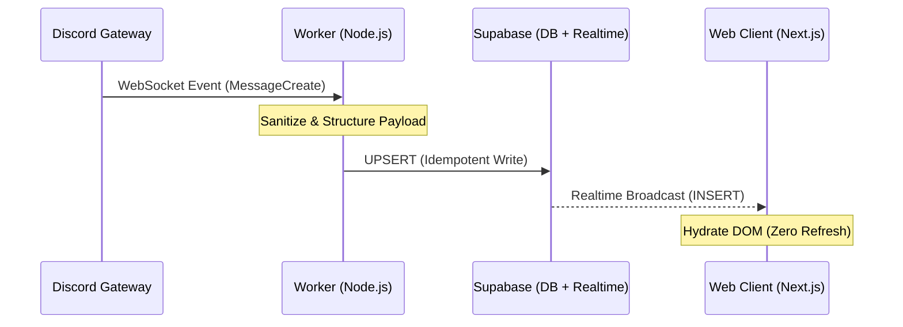

# ⚡ Discord Live-Stream — Low-Latency Support Observer

<blockquote>
  <p><strong>A forensic observability pipeline that bridges internal Ops (Discord) with external visibility (Web).</strong></p>
</blockquote>

This project is <strong>not a chat bot</strong>.<br />
It is a <strong>real-time event ingestion and observability system</strong> designed to demonstrate disciplined
full-stack engineering and production-aware trade-offs.

It solves a classic Support problem:

<blockquote>
  <p><strong>“How do we observe the support queue in real time without being logged into the admin platform?”</strong></p>
</blockquote>

---

## 🧭 What This System Does

- Listens to live Discord events via the Gateway  
- Sanitizes and persists messages into a durable store  
- Broadcasts updates to a web client in real time  
- Retains history even if the ingestion service crashes  

<strong>The result:</strong> a live, read-only support stream accessible from the web, with zero refresh and no admin access required.

---
## 🧱 The Stack (The “Railway Standard”)

### Ingestion (The Ear)
- Node.js + Discord.js (Gateway Intents)
- Running as a persistent Worker

### State & Sync (The Brain)
- Supabase
- PostgreSQL for persistence
- Realtime engine for fan-out

### Presentation (The Face)
- Next.js 16 (App Router)
- Tailwind CSS

### Infrastructure
- Monorepo deployed on Railway

---
### 🧠 Engineering Decisions & Trade-offs

This system is built with failure in mind.

1. Persistence Layer — Why Supabase?

<strong>Decision:</strong> Supabase instead of direct Bot ➜ Client WebSockets

<strong>Why:</strong>

- Full decoupling between ingestion and presentation

- No data loss if the worker crashes or restarts

- Enables history hydration + live updates from a single source of truth

- A direct socket would drop all state the moment the worker dies.

---
### 2. Execution Model — Why a Worker?

<strong>Decision:</strong> Dedicated background Worker instead of a Next.js API route

<strong>Why:</strong>

- Discord bots require a persistent heartbeat

- Serverless functions are ephemeral by design

- Running a bot inside API routes causes zombie processes and rate-limit failures

- The worker runs independently of web traffic and deployment cycles.

---
### 3. Idempotency — Solving the “Duplicate Event” Problem

<strong>Decision:</strong> UPSERT using discord_message_id as the primary key

<strong>Why:</strong>

- Network retries and gateway reconnects happen

- Packet replays must not create duplicate records

- Processing the same event twice always results in <strong>one database row</strong>.

---
### 🐛 Production Considerations (Forensic Audit)

If this were deployed for enterprise support teams, the next hardening steps would be:

- Security (RLS)

Currently public for demo speed.
Production would gate access via Discord OAuth + role checks.

- Backfill Logic

Messages sent while the worker is offline are currently missed.<br />
A production version would fetch channel history on boot to close gaps.

- Latency

Discord ➜ Bot ➜ DB ➜ Client adds a small hop.<br />
For support observability, sub-100ms latency is acceptable and predictable.

- Client-Side Scalability (Unbounded List)

Current State: The frontend renders the entire message history in the DOM.
Limitation: Long-running sessions in high-volume channels will eventually cause memory exhaustion (DOM)
Production Fix: Implement "Windowing" (e.g `react-window`) or "Cursor-based Pagination" to only render visible nodes.

---

### 🧩 Why This Project Exists

This repository is a <strong>signal</strong>, not a product.

- Demonstrates real-time systems thinking

- Shows production-aware trade-offs

- Treats support infrastructure as first-class engineering

<blockquote> <p><strong>Support is not tickets — it’s telemetry.</strong></p> </blockquote> 

---

### 🚀 Local Setup (Forensic Mode)

**Prerequisites**
- Node.js v18+
- Supabase project
- Discord bot token

```bash
# 1. Clone the repository
git clone https://github.com/Timo1304/railway-bot-demo.git
cd railway-bot-demo

# 2. Install dependencies
npm install
```

---

# Environment Configuration

Create a `.env` (or `.env.local`) file in the root directory:

## Discord
DISCORD_BOT_TOKEN=your_discord_bot_token_here

DISCORD_CHANNEL_ID=your_channel_id_here
### (Right-click a text channel in Discord > Copy Channel ID. Requires Developer Mode ON)

## Supabase
NEXT_PUBLIC_SUPABASE_URL=your_supabase_url

NEXT_PUBLIC_SUPABASE_ANON_KEY=your_supabase_anon_key

SUPABASE_SERVICE_ROLE_KEY=your_service_role_key
### (Required for the worker to bypass RLS and perform upserts)

---
# Dual-Process Startup (By Design)

Because the system is decoupled, <strong>two processes must run simultaneously</strong>.

<strong>Terminal 1 — Web Interface</strong>
```bash
npm run dev
```

---
<strong>Terminal 2 — Ingestion Worker</strong>
```bash
npx tsx bot/bot.ts
```

# Verification

- Open http://localhost:3000

- Send a message in your Discord server

- Watch it appear instantly in the web UI — no refresh required

---

## 🏗 System Architecture

The system follows a <strong>Decoupled Event-Driven Architecture</strong>.<br />
The ingestion layer (Discord Worker) and presentation layer (Web) are fully independent, linked only by a real-time database.

<strong>Mermaid Diagram</strong>


